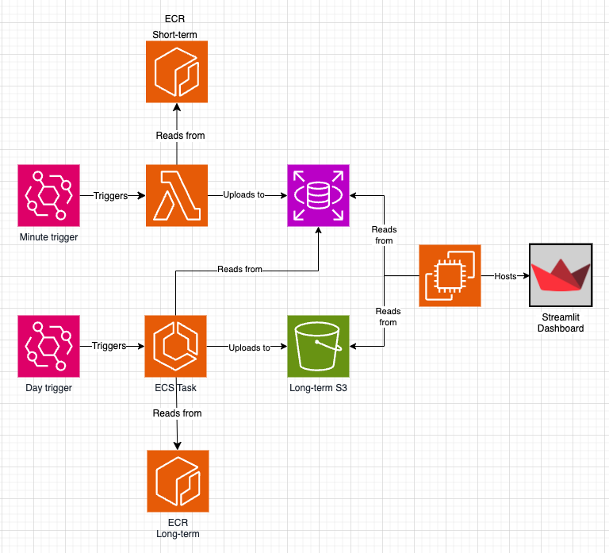
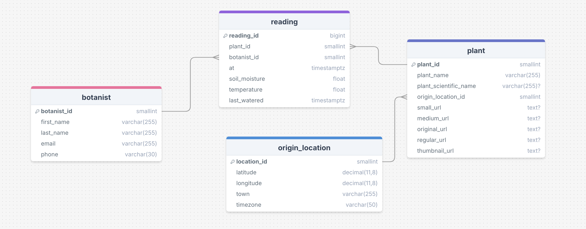

# 🌿 Week 13: LMNH Plant Health

## 📝 Project Overview

The **LMNH (Liverpool Museum of Natural History)** has deployed an array of sensors to monitor plant health. Currently, the system is equipped with a single API endpoint that reports the **current health** of a plant. However, the museum aims to track the **long-term health** of plants and send alerts to gardeners when issues arise.

To achieve this, the museum needs:
- **Long-term data storage**
- **Data visualisation**
- **Automated alerting system** for plant health monitoring

---

## 🎯 Project Aims

This project is focused on creating an **automated data analysis pipeline** to assist the botanical gardens of LMNH. The core deliverables include:

- **Data Pipeline**: A seamless system that collects, stores, and processes plant health data.
- **Insights Dashboard**: An interactive dashboard providing visual insights into plant health over time, across various key metrics.

---

## 🛠️ Technical Overview

### ⚡ Short-term Pipeline (AWS Lambda - Runs Minutely)
- 🌐 **API Interaction**: Asynchronously queries the plant API endpoints for real-time data.
- 💾 **Data Storage**: Uploads plant health readings to an **MS SQL Server (RDS)** instance.

### 📊 Long-term Pipeline (AWS Lambda - Runs Daily)
- ⏳ **Historical Data Processing**: Fetches the past day's data from the RDS instance.
- 📈 **Data Analysis**: Processes and calculates key statistical metrics from the gathered data.
- 🗃️ **Archival**: Uploads the analysed metrics to an **S3 bucket** for long-term storage and archiving.

---

#### 📂 Architecture Diagram

---

## 📊 Interactive Dashboard

- **Pulls real-time and historical data** from the RDS instance.
- Provides **insights into plant health metrics** over time.
- Offers **visualisation tools** to help monitor trends and detect early signs of potential problems.

#### 🗺️ Database Schema

